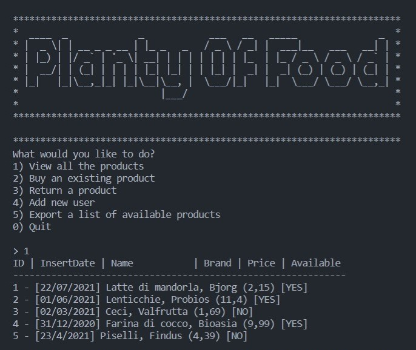

# Progetto Java Basics per Start2Impact

## Descrizione

Il progetto prevede la creazione di un programma in Java che, leggendo e scrivendo file csv, permetta di acquistare prodotti bio.
Eseguendo il programma da terminale, all'utente viene presentato un prompt che raccoglie un input numerico ed esegue l'azione corrispondente.  
Nello specifico, l'utente può:

- visionare la lista dei prodotti
- acquistare un prodotto
- restituire un prodotto
- registrarsi
- stampare un file con i prodotti disponibili

### Screenshots

## Testing

### Come compilare

Per compilare l'applicazione è necessario innanzitutto avere Java e Maven installati sulla propria macchina.
Basta seguire le istruzioni riportate sulle documentazioni ufficiali di [Java](https://www.oracle.com/java/technologies/downloads/#java17) e [Maven](https://maven.apache.org/).

Dopodiché è sufficiente eseguire tre semplici passi:

1. Clonare il progetto
2. Nella directory principale eseguire `mvc compile`
3. Se tutto è stato compilato senza errori, eseguire `mvc clean package` per creare un file jar

### Come eseguire

Creato il file jar, è possibile eseguirlo per testare l'applicazione attraverso il comando `java -jar .\target\application.jar`

NB: l'applicazione necessita dei file _utenti.csv_, _vendite.csv_ e _prodotti.csv_ posizionati nella directory principale per funzionare correttamente.
